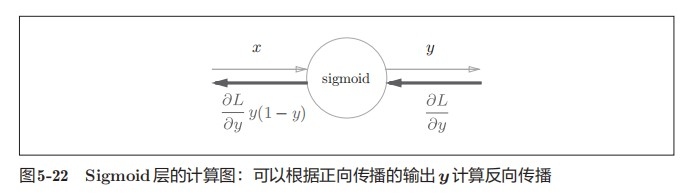

# 人工神经网络与卷积神经网络

# 神经网络

### 感知机

感知机接收多个输入信号，输出一个信号。如下图所示即为一个感知机

\theta)\end{cases}"/>

常见的应用有**与门**（），**或门**（）以及**与非门**（）

但一般的感知机只能解决线性问题，无法解决如异或门这样的问题。可以使用**多层感知机**组合多个门电路来实现，如下所示：

### 激活函数

激活函数用来决定如何来激活输入信号的总和，常见的激活函数如下

#### Sigmoid函数

#### 阶跃函数

0)\end{cases}"/>

#### ReLU函数

0)\\0\quad(x\le0)\end{cases}"/>

### 损失函数

神经网络的学习中所用的指标称为损失函数，它是表示神经网络性能的“恶劣程度”的指标，通常使用均方误差和交叉熵损失误差等。

#### 均方误差

其中，表示神经网络的输出，表示监督数据，k表示数据的维度

#### 交叉熵损失

其中，log表示以e为底的自然对数，是神经网络的输出，是正确解标签

#### mini-batch学习

如果使用mini-batch来学习，损失函数应该做出相应的改变，如交叉熵损失函数应变为如下形式：

其中，数据有N个，表示第n个数据的第k个元素的值（是神经网络的输出，是监督数据）

### 学习算法

#### 数值微分和梯度

对于函数导数的近似求解，可采用数值微分的方法，即：

对于偏导数，固定一个变量的值，求出另一个变量的近似导数即可。在更新时，常使用梯度下降法来做，如：

      

#### 计算图计算梯度

计算图可以通过局部计算，将复杂的全局计算转化为简单的局部计算。具体方式是将复杂图拆分为一个一个简单的节点，而后使用链式法则进行求解即可。

##### 加法节点

对于z=x+y，先z对x及y分别求导，可得如下偏导数：

其反向传播可以通过下图表示：

##### 乘法节点

考虑z=xy，可以得到如下偏导数：

其反向传播可以通过下图表示：

##### ReLU层

ReLU原函数如下：

0)\\0\quad(x\le0)\end{cases}"/>

求出y关于x的导数如下：

0)\\ 0\quad(x\le0)\end{cases}"/>

其计算图如下：

#### Sigmoid层

Sigmoid原函数：

Sigmoid导数：

其计算图如下：

#### Softmax-with-Loss

### 学习技巧

#### 参数更新

##### SGD

但如果函数的形状非均向，搜索的路径就会非常低效，如下图所示：

##### Momentum

##### AdaGrad

##### Adam

融合了Momentum和AdaGrad的方法

#### 权重初值

* 权重的初始值一般不要设为0，可以尝试使用均值小的正态分布

* 可以尝试使用Xavier初始值等来初始化权重

#### Batch Normalization

为了使得各层拥有适度的广度，从而可以顺利地进行学习，一般是插入在激活函数层前面。它以进行学习时的mini-batch为单位，按mini-batch进行正规化，即进行均值为0，方差为1的正则化，如下所示：

#### 正则化

在网络的训练过程中很容易出现过拟合。一般来说，是由于模型拥有大量参数、表现力强或者是训练数据少造成的。可使用如下方式来抑制过拟合：

##### 权值衰减

该方法通过在学习的过程中对大的权重进行惩罚，来抑制过拟合。具体方式就是为损失函数加上权重的平方范数（L2范数），从而抑制权重变大。

##### Dropout

当网络变得复杂时，就难以只使用权值衰减来解决了，此时可采用Dropout方法。如下所示：

## 人工神经网络的实现

**三层神经网络进行手写数字体(MNIST)识别**（使用激活函数、Batch-Normalization、Dropout、误差反向传播算法，Softmax-with-Loss等）

