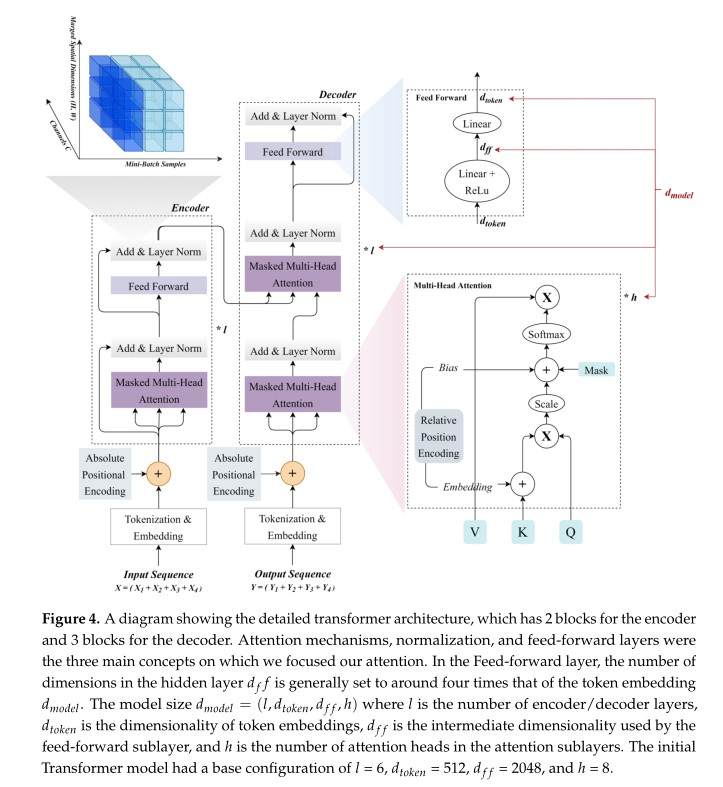
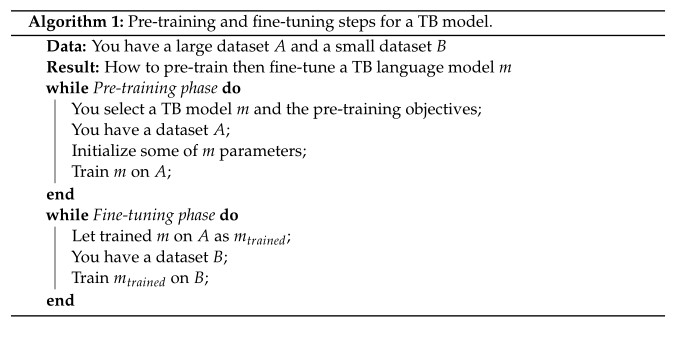

# 自然语言处理综述

NLP模型根据其主要架构可分为三类：RNNs，CNNs和attention-based

## 循环神经网络（RNN）

传统RNN存在误差减小问题，有用**ReLU**代替sigmoid函数的、使用**LSTM**的，或者使用门控循环网络(**GRUs**)的

但这些架构计算速度慢，在确定当前状态时无法考虑未来的输入，以及访问过去信息的额外挑战。最重要的是无法并行

## 编码器-解码器架构

Seq2Seq通常使用这种架构，如下图所示

但这种架构存在两个问题：

* 编码后的数据经过压缩形成一个固定长度的向量，再将这个向量发送到解码器，这个过程中会有丢失信息的风险
* 无法描述需要结构化输出的任务(如翻译和摘要)所必须的输入-输出序列对齐

## Transformer

最初由**Vaswani**提出，用于解决rnn和编码器-解码器的缺点

### 注意力机制

此机制使用解码器状态（Q:query）和编码器隐藏状态（K:keys）来计算注意力权重，在历史上表示编码器隐藏状态（V:values）在处理解码器状态的相关性。一个称为注意力（Q,K,V）的广义注意力模型使用一组键值对(K,V)和一个称为Q的查询：

其中，是分布函数，常常使用logistic,sigmoid和softmax函数等。是对齐函数，原始Transformer中使用**点积对齐**，其他常见的对齐函数如下：

自注意也称内注意，它将单个序列的各个位置联系起来，以创建序列的表示：

**多头注意层**由多个注意头组成。每个注意头计算其输入V,K和Q的注意力，同时使它们进行线性转换，如下所示：

掩码多头注意网络参与之前的解码器状态，其中，，自注意的输出如下所示：

### 位置编码

 位置编码用于解决注意力机制忽略了关于每个单词位置的细节，可以根据每个单词在当前序列中的位置对其进行编码。并使用如下公式计算：

其中，是嵌入维数（ embedding dimension），是序列中的位置（0到n-1），是嵌入维数中的位置（从0到）。**Transformer-XL**就使用了相对位置编码

### 位置前馈网络(Position-Wise Feed-Forward Networks)

Position-Wise指的是前馈层类型，它对序列中每个位置使用相同的密集层。接收三维形式的输入（批量大小、序列长度和特征大小），位置前馈网络(FFN)块有两个完全连接的层，隐藏层函数通常使用ReLU，也可使用**GELU**（高斯误差线性单元）代替。FFN定义如下：

完整的网络结构如下图所示：

上述架构中，编码器有两个块，解码器有三个块。每层之间都有一个残余连接，然后进行层归一化。

### Pre-Train和Fine-Tune架构

对于那些训练数据很少的任务，对大型模型进行预训练，并将其缩减为较小的模型以用于实际应用，已经成为一种标准程序。在使用基于文本的模型时，通常会区分预训练和微调阶段。预训练阶段在一个相当大的通用语料库上进行训练，微调阶段会修改模型以适用特定的任务或数据集。常见做法如算法1所示：

#### 预训练过程

预训练包括一个用于标记器用于编码，而后在其上训练一个TB模型。文本序列被分解成更小的部分或标记，然后作为输入输入到TB NLP模型中，如**BERT**。

传统的词嵌入：**Word2vec**、**GloVe**；目前常用的有：**BERT**使用WordPiece令牌、**mBERT**、**GPT2**、**RoBERTa**以及**XLM**

最常用的标记化类型是：字节对编码(**BPE**)，字节级BPE(**bBPE**)，**SentencePiece**以及**WordPiece**

常见的预训练模型、损失函数以及使用该训练前目标的示例

#### 微调过程

微调过程将目标语料库与预期的任务结合起来使用。通过改变预训练好的模型的权重来处理特定任务。

## TB模型的应用

根据Transformer使用模式的变化，可创建不同类别的Transformer：只包含编码器（也叫自动编码器，AE），只包含解码器（也叫自动回归器，AR）以及编码器-解码器框架(S2S)

按照应用程序分类可以分为：问答(QA)、情绪分析(SA)、文档摘要(DS)、机器翻译(MT)、主题建模(TM)、文本分类(TC)、文本生成(TG)和文本汇总(TS)

